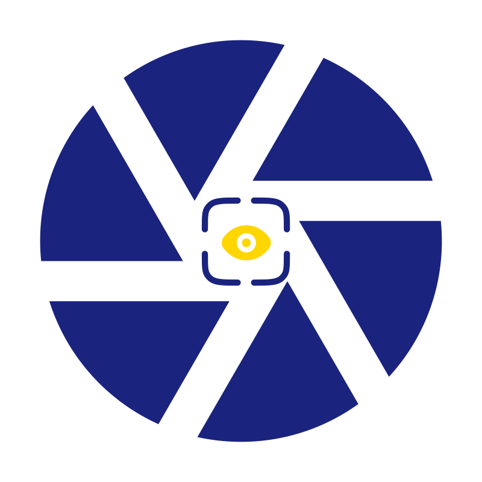
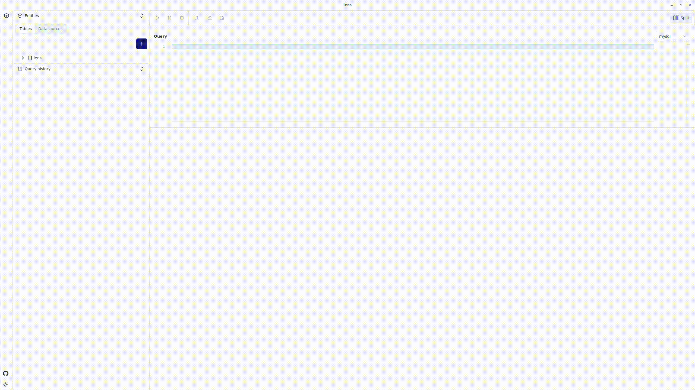

<h1 align="center">Lens</h1> <br>
<p align="center">
  
</p>


[![LICENSE][license-badge]][license]
![build-badge]
![rust-badge]
![svelte-badge]

<p align="center">
  Lens through your data. Built with  <a href="https://tauri.app/">Tauri</a>
</p>

 <br />

## 💡 About

Powerful, lightweight application that provides an interactive interface to run SQL queries on structured files, including Parquet, CSV, and JSON formats. <br />
You can use Lens locally or directly access data stored in cloud services like Amazon AWS or Google GCP. <br />
Lens simplifies data analysis by allowing you to query, transform, and visualize data without complex setup or external databases.

## Table of Contents

- [Features](#features)
- [Installation](#installation)
  - [From source](#from-source)
- [Roadmap](#roadmap)
- [License](#license)

## Features
- 📁 **Support for Multiple File Formats:** Query data stored in Parquet, CSV, and JSON files.
- 🌥 **Cloud Integration:** Seamlessly connect to cloud storage services like AWS S3 or Google Cloud Storage to run SQL queries on remote datasets.
- 💻 **Local Support:** Run SQL queries on files located on your local machine.
- 🖊 **SQL Interface:** Use familiar SQL syntax to query and transform data.
- 📔 **Query History:** Save and replay previous SQL queries to streamline repetitive tasks.
- 👁 **Data Visualization:** View query results in tabular format
- 🔒 **Privacy:** No data is sent to any external service. Files are processed either locally or directly from your cloud provider.
- 💾 **Export Results:** Easily export query results to CSV, JSON, or other formats.


## Installation

### From source

#### Prerequisites

Lens is built with [tauri](https://tauri.app/) using a [Rust](https://www.rust-lang.org/) backend.
To build lens from source, first clone the git repository:

```bash
git clone https://github.com/oktal/lens.git
```

Then, to install all the dependencies required for tauri, you can follow the official [Prerequisites](https://tauri.app/v1/guides/getting-started/prerequisites) section of the Tauri' documentation

Use [rustup](https://www.rust-lang.org/tools/install) to install Rust on your system.
Also make sure to install [Nodejs](https://nodejs.org/en)


#### Build

Once you followed all the steps described in the previous section, build and start lens through `npm`:

```bash
npm install
npm run tauri dev
```

## Roadmap
 - [ ] Monaco-based SQL editor
   - [x] Syntax highlighting
   - [ ] Auto completion
- [ ] Integration with other database systems: MySQL, PostgreSQL, SQLite, DuckDB
- [ ] Charts 
- [ ] Configuration options
  - [ ] Expose DataFusion session configuration parameters in the UI
  - [ ] Profile-based configuration
- [ ] Querybook as way to share queries between developers and users, like Jupyter Notebook
     
## Sponsor

Lens is a free and open-source software but if you want to sponsor me, as a specialty coffee lover you can <br />
<a href="https://www.buymeacoffee.com/octal" target="_blank"></a>

## License

This project is licensed under the MIT License. See the [LICENSE](LICENSE) file for more details.

[license]: LICENSE
[license-badge]: https://img.shields.io/badge/license-MIT-green?style=for-the-badge
[build-badge]: https://img.shields.io/github/actions/workflow/status/oktal/lens/build.yml?style=for-the-badge
[rust-badge]: https://img.shields.io/badge/rust-logo?style=for-the-badge&logo=rust&color=gray
[svelte-badge]: https://img.shields.io/badge/svelte-logo?style=for-the-badge&logo=svelte&color=gray
